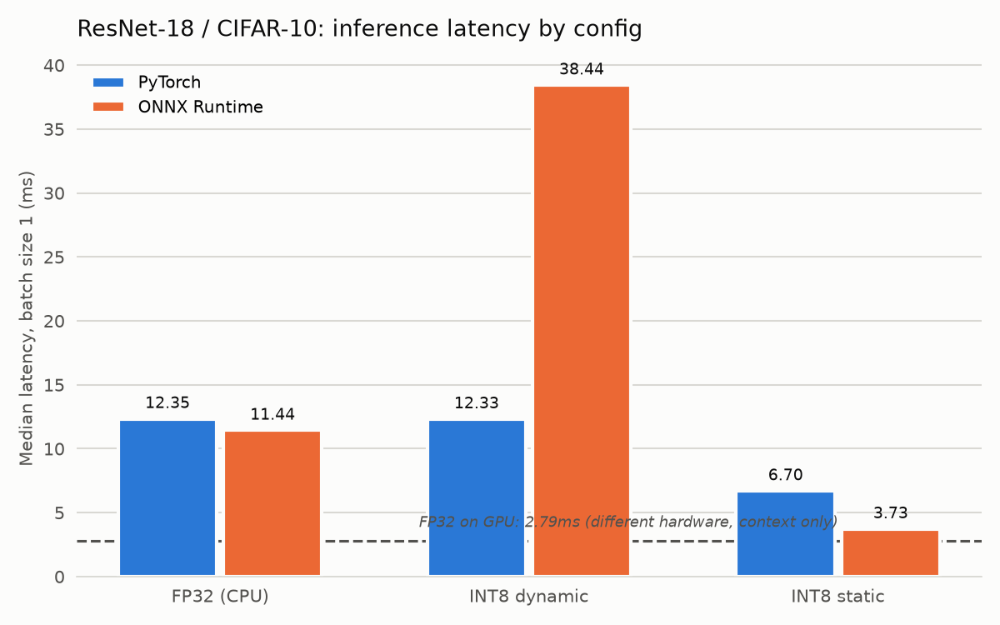

# int8-inference-lab

Benchmarking post-training INT8 quantization of ResNet-18 across two runtimes
-- PyTorch and ONNX Runtime -- measuring latency, model size, and top-1
accuracy for each configuration, on the same hardware, in the same session.

## Status

Done. All six configurations (PyTorch and ONNX Runtime, each
FP32/dynamic/static) are benchmarked, plus a per-layer weight
sensitivity analysis -- see `PHASE1_QUANTIZATION_PLAN.md` for the
commit-by-commit history.

## Results

Every row below is the same fine-tuned ResNet-18 checkpoint (94.73% top-1
in isolation), scored on the same fixed 10,000-image CIFAR-10 test set,
in one Kaggle session (T4 GPU + its host CPU) -- checkpoint, hardware,
and session all held constant so latency and accuracy deltas are actually
attributable to the precision/runtime change in each row, not to
re-fine-tuning variance or a different machine. Latency is single-image
(batch size 1), median and p95 over 100 timed runs after 10 warmup
iterations.

| Config | Runtime | Device | Median (ms) | p95 (ms) | Size (MB) | Top-1 | Δ Accuracy |
|---|---|---|---|---|---|---|---|
| FP32 | PyTorch | GPU | 2.794 | 3.902 | 42.70 | 94.73% | *(different hardware -- context only)* |
| FP32 | PyTorch | CPU | 12.345 | 19.262 | 42.70 | 94.73% | baseline |
| INT8 dynamic | PyTorch | CPU | 12.326 | 13.455 | 42.69 | 94.72% | -0.01 pp |
| INT8 static | PyTorch | CPU | 6.699 | 11.602 | 10.78 | 94.67% | -0.06 pp |
| FP32 | ONNX Runtime | CPU | 11.439 | 13.167 | 42.62 | 94.73% | 0.00 pp |
| INT8 dynamic | ONNX Runtime | CPU | 38.439 | 41.005 | 10.71 | 94.54% | -0.19 pp |
| **INT8 static** | **ONNX Runtime** | **CPU** | **3.727** | **4.283** | **10.69** | **94.45%** | **-0.28 pp** |



**Why there are two FP32-PyTorch rows:** PyTorch's eager-mode INT8
kernels (dynamic and static alike) run through CPU backends
(fbgemm/qnnpack) -- there is no CUDA path for them. Comparing INT8-on-CPU
latency against FP32-on-GPU would conflate "the GPU is faster than a CPU
core" with "quantization made this faster," a different claim. The
FP32-CPU row is the fair, same-hardware baseline the INT8 rows should
actually be read against; the FP32-GPU row is there because it's the
number a reader instinctively expects to see, not because it's a valid
comparator for the rows below it.

**Dynamic quantization** (`torch.quantization.quantize_dynamic`) converts
weights to int8 once, ahead of time, but only for the layer types you
target -- here, `nn.Linear`. ResNet-18 has exactly one Linear layer: the
final 512-unit classifier head, about 5,120 weights out of the network's
~11.2M. Every convolution and BatchNorm -- where nearly all the compute
and parameters actually live -- stays FP32. Activations for that one
Linear layer get quantized on the fly at every call (their min/max
computed per-batch, with no calibration step), which is itself a small
amount of overhead. The result above is exactly what that combination
predicts: essentially no change in size or accuracy (-0.01pp, noise), and
latency that's a wash -- within noise of FP32-CPU either way. Dynamic
quantization's win depends on the quantized op being expensive enough to
outweigh its own bookkeeping, and a 512x10 matmul isn't.

**Static quantization** quantizes the convolutions too, which is where
the payoff actually is on a conv-heavy network. It costs a calibration
pass (20 batches of real CIFAR-10 training data shown to the model,
purely to let observers record realistic activation ranges -- no
gradient, no weight update) and a module-fusion step (folding each
BatchNorm into its preceding conv so the observer sees one quantized op's
real output instead of a float BN sitting between two int8 boundaries).
The result: **~1.84x faster than FP32-CPU** (6.699ms vs 12.345ms),
**~3.96x smaller on disk** (10.78MB vs 42.70MB, close to the theoretical
4x ceiling for fp32->int8), for a 0.06pp accuracy cost. Static
quantization needs more setup than dynamic (a qconfig, a calibration
dataset, fuse/prepare/convert instead of one function call), but on this
architecture it earns that setup back with a real speedup that dynamic
quantization simply doesn't deliver.

**ONNX Runtime's FP32 baseline** is ~7.3% faster than PyTorch's FP32-CPU
(11.439ms vs 12.345ms) at identical accuracy -- the same weights, the
same precision, just a different execution engine. That gap is from
ONNX Runtime's graph-level optimizations (constant folding, operator
fusion) rather than anything quantization-related, which is exactly why
this baseline was worth measuring on its own before adding ONNX Runtime's
INT8 paths: without it, any ORT-INT8 speedup claim would be ambiguous
about which effect -- runtime or precision -- it's actually crediting.

**ONNX Runtime's dynamic quantization inverts the PyTorch story, and not
in a good way.** Unlike PyTorch's `quantize_dynamic` (Linear layers
only), ORT's default dynamic quantizer targets convolutions too --
inspecting the exported graph's op types before/after shows all 20 `Conv`
nodes converted to `ConvInteger`, alongside the `fc` layer's `Gemm`
becoming `MatMulInteger`. So this genuinely quantizes the entire
backbone, unlike its PyTorch counterpart. The result is **~3.4x *slower*
than ORT's own FP32** (38.439ms vs 11.439ms median), plus the only
dynamic-quant accuracy drop across either framework (-0.19pp -- still
small, but not the flat 0.00pp both PyTorch's dynamic quant and this same
ORT pass at FP32 showed). `ConvInteger` is a much less optimized kernel
than ORT's FP32 `Conv` (no fused, pre-scaled int8 path the way static
quantization's `QLinearConv` gets), and every one of the 20 conv layers
now pays a `DynamicQuantizeLinear` (compute this call's activation
min/max, quantize) plus a `Cast`+`Mul` (dequantize back to float) around
it. Multiply dynamic quantization's per-call bookkeeping cost -- the same
mechanism that made PyTorch's dynamic quant a wash on one layer -- by 20
conv layers, and it stops being a wash and starts being a real
regression. This matches ONNX Runtime's own published guidance: dynamic
quantization is aimed at RNN/Transformer models, and CNNs are
specifically where they recommend static quantization instead.

**ONNX Runtime's static quantization is the best result in this whole
project.** **~3.07x faster than ORT's own FP32** (3.727ms vs 11.439ms),
**~1.8x faster than PyTorch's own static quantization** (6.699ms), and
**~3.99x smaller on disk** (10.69MB vs 42.62MB) for a 0.28pp accuracy
cost. Getting here took one real fix worth documenting: the first
attempt used `QuantFormat.QOperator` with both weights and activations as
signed int8 ("s8s8") and came back *slower than the dynamic-quant
regression* (55ms median) -- ORT's own quantizer warns about this exact
combination, because its fast, VNNI-oriented CPU kernels are built for
**u8 activations x s8 weights** ("u8s8"), and s8s8 with `QuantFormat.
QOperator` falls back to a slow reference kernel on x64. Setting
`activation_type=QuantType.QUInt8` alongside `weight_type=QuantType.
QInt8` -- the standard u8s8 combination -- fixed it completely, unlocking
`QLinearConv`'s fused kernel path (the thing dynamic quantization's
`ConvInteger` lacked) on top of pre-calibrated, fixed activation ranges
(the thing dynamic quantization also lacked). Static quantization wins on
both frameworks for the same underlying reason -- it's the only approach
that gives the runtime both a fused int8 kernel *and* no per-call
quantization bookkeeping -- but ONNX Runtime's implementation of that
combination is simply faster than PyTorch's on this hardware.

## Layer sensitivity analysis

To find out which layers actually cost accuracy under quantization,
`src/run_layer_sensitivity.py` fake-quantizes one Conv2d/Linear layer's
weights to int8 at a time (per-channel, symmetric -- the same scheme the
real static-quantization runs above use for weights), leaves every other
layer FP32, and measures the top-1 accuracy drop against the full
10,000-image test set. Full results: `results/layer_sensitivity.json`.

**The finding: sensitivity is flat and negligible across all 21 layers.**
Every single-layer drop falls within +/-0.05pp -- on a 10,000-image test
set, that's a swing of five images or fewer, indistinguishable from noise.
`layer4.0.conv1` "ranks" highest at +0.05pp, but that's not meaningfully
different from `layer2.0.conv1` at +0.01pp or `fc` at -0.01pp (accuracy
went up slightly). Notably, `conv1` (the first layer) and `fc` (the last)
-- the two spots a common quantization heuristic says should be most
vulnerable -- show no outsized sensitivity here at all. That heuristic
doesn't hold for this network.

Why so robust: **per-channel** quantization (each output channel gets its
own scale) is far more precise than per-tensor, so no layer gets dragged
down by one badly-scaled channel. It also isolates *weight* quantization
error specifically, with activations left untouched -- and the real
static-quantized models above (weights *and* activations quantized
together) showed larger drops, 0.06-0.28pp, than any single layer's
weight-only error measured here. That comparison is the actual insight:
**activation quantization, not weight quantization, is the dominant
source of whatever small accuracy cost this network pays under full INT8
quantization.** A per-layer weight sensitivity scan alone would have
missed that; it only becomes visible by comparing this analysis against
the full-pipeline numbers from commits 6 and 10.

## When I'd choose each approach

- **FP32 on GPU** -- worth naming explicitly: at 2.794ms, it's still the
  *fastest single row in this entire table*, faster than even ONNX
  Runtime's best INT8-CPU result (3.727ms). If a GPU is already part of
  the deployment target, none of the CPU-oriented quantization work here
  is trying to beat it -- it can't, on a model this small. Everything
  below is about what to do when it isn't.
- **Dynamic quantization** -- skip it for CNNs; both frameworks
  demonstrated why. PyTorch's version is a wash (it only touches one
  small Linear layer), and ONNX Runtime's version, which quantizes every
  conv, is an active regression (~3.4x slower) because `ConvInteger`
  lacks a fused kernel and pays per-call quantize/dequantize overhead 20
  times over. It's the right tool for Linear/RNN/Transformer-heavy models
  (BERT-style encoders, LSTMs) -- architectures where quantize_dynamic's
  one-function-call simplicity is quantizing most of the network's
  compute, not a rounding error's worth of it.
- **Static quantization (PyTorch)** -- the pragmatic choice when ONNX
  export isn't an option (a model with control flow tracing can't handle
  cleanly, or a deployment stack that's PyTorch-only): ~1.84x faster than
  FP32-CPU, ~4x smaller, 0.06pp accuracy cost, entirely within the
  PyTorch ecosystem.
- **Static quantization (ONNX Runtime)** -- the best CPU deployment
  option measured in this project: ~3.07x faster than ORT's own FP32,
  ~1.8x faster than PyTorch's static path, ~4x smaller, for a 0.28pp
  accuracy cost. The real caveat is the s8s8-vs-u8s8 kernel-selection
  footgun this project hit directly (commit 10) -- `QuantFormat.QOperator`
  with the wrong activation/weight type combination silently falls back
  to a slow reference kernel on x64 instead of erroring, so it's easy to
  ship a "quantized" model that's slower than FP32 without realizing it.
  Getting the u8s8 combination right is what makes this the fastest
  config in the table instead of the slowest.

## Setup

Developed and run on Google Colab and Kaggle Notebooks (free tier, T4
GPU).

```bash
pip install -r requirements.txt
```

To reproduce all results in one sitting (required -- see CLAUDE.md on why
cross-session latency comparisons aren't valid):

```bash
python -m src.finetune              # fine-tunes the CIFAR stem + head, ~7 min on a T4
python -m src.run_baseline          # FP32 GPU -> results/baseline.json
python -m src.run_dynamic_quant     # PyTorch dynamic INT8 + FP32-CPU reference
python -m src.run_static_quant      # PyTorch static INT8
python -m src.run_onnx_baseline     # ONNX export + FP32 baseline
python -m src.run_onnx_dynamic_quant
python -m src.run_onnx_static_quant
python -m src.run_layer_sensitivity
```

## Repo layout

- `src/` -- model loading, benchmarking harness, quantization scripts
- `results/` -- one JSON file per configuration, produced by the harness,
  plus the generated latency chart
- `scripts/plot_results.py` -- regenerates `results/latency_comparison.png`
  from the JSON files; local-only, no GPU/session needed
